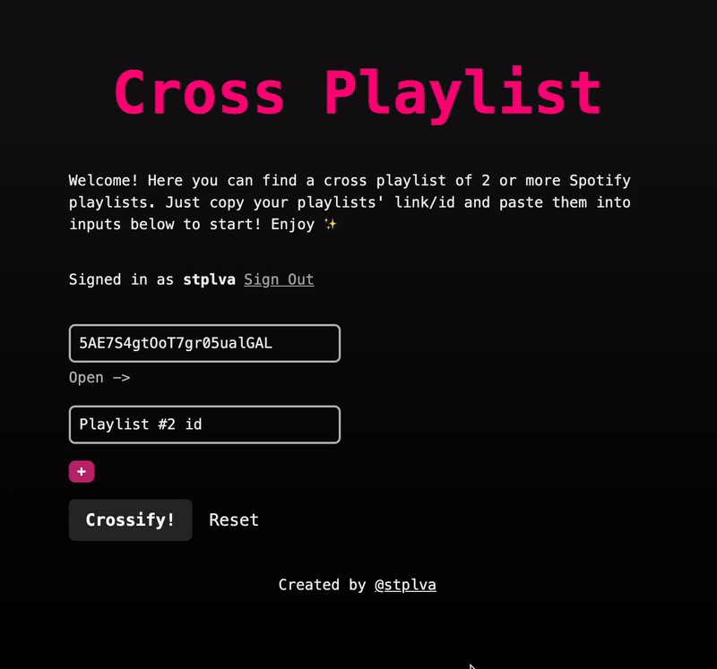

# Cross Playlist – Spotify Playlist Overlap Finder

This is a project that finds an intersection between your playlists – a so called cross-playlist!

Easily compare Spotify playlists and find the songs they have in common. Perfect for creating shared playlists or finding your music overlap!

Built with Next.js. Auth is handled by next-auth and Spotify Provider.

## Development

1. Clone this repo: `git clone git@github.com:stplva/cross-playlist.git`
2. Install dependencies: `npm install`
3. Set up environment variables: `cp .env.example .env.local`. Check your [Spotify dashboard](https://developer.spotify.com/dashboard) for values.
4. Start application: `npm run dev`
5. Go to [http://localhost:3000](http://localhost:3000)

## Deployment

To deploy with **Vercel**:

1. Add Spotify Provider's client ID and client secret to environment variables (can be found in .env)
2. Create a `NEXTAUTH_SECRET` environment variable. You can use `openssl rand -base64 32` to generate a random value.
3. You do not need the NEXTAUTH_URL environment variable in Vercel.
4. (Don't forget to add your app's url as Redirect URI in Spotify Dashboard)
5. Deploy!

If you wish to deploy your application to another server/host, you must provide these 2 env variables:

- `NEXTAUTH_URL`=url_of_your_app
- `NEXTAUTH_SECRET`=hash_key

## Learn More

To learn more about Next.js or deployment to Vercel, take a look at the following resources:

- [Next.js Documentation](https://nextjs.org/docs)
- [Next.js deployment documentation](https://nextjs.org/docs/deployment)
- [NextAuth deployment documentation](https://next-auth.js.org/deployment)
